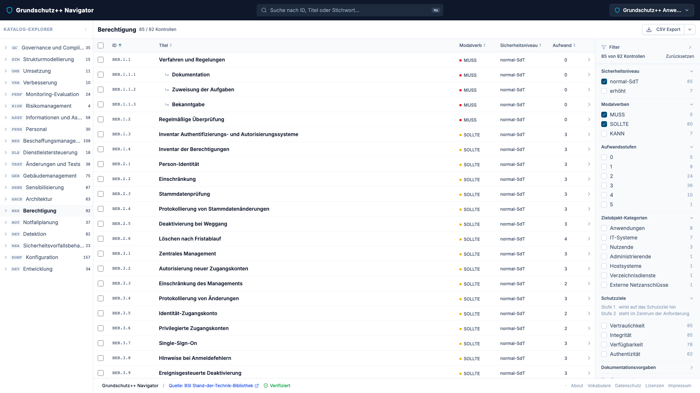

# Grundschutz++ Navigator

Der Grundschutz++-Anwenderkatalog des BSI zum Durchsuchen, Filtern und Exportieren, direkt im Browser.

Inoffizielles Community-Projekt, kein Angebot des BSI. Keine Rechtsberatung, keine Gewähr. Die offiziellen Daten veröffentlicht das BSI in der [Stand-der-Technik-Bibliothek](https://github.com/BSI-Bund/Stand-der-Technik-Bibliothek).

**Live-Demo:** [dfurater.github.io/Grundschutz-Navigator](https://dfurater.github.io/Grundschutz-Navigator/)



[](https://github.com/dfurater/Grundschutz-Navigator/actions/workflows/deploy.yml)
[](LICENSE)
[](https://github.com/BSI-Bund/Stand-der-Technik-Bibliothek)

## Was kann die App?

- Drei BSI-Kataloge durchblättern: den Grundschutz++-Anwenderkatalog sowie die Anwenderkataloge Lieferkettensicherheit und WLAN, gegliedert nach Praktiken und Themen.
- Alle Kontrollen nach ID, Titel oder Stichwort durchsuchen.
- Die Liste nach Sicherheitsniveau, Modalverb, Aufwandsstufe, Zielobjekt-Kategorie, Schutzziel, Dokumentationsvorgabe, Handlungswort, Tag und Link-Relation filtern.
- Zu jeder Kontrolle den Anforderungstext, die Umsetzungshinweise, die betroffenen Schutzziele und die Gefährdungen lesen.
- Die BSI-Vokabulare nachschlagen, also die Begriffslisten, auf denen Filter und Kontrollen aufbauen.
- Die gefilterte Liste, Suchtreffer oder eine eigene Auswahl als CSV-Datei exportieren.

Die App funktioniert am Desktop und auf dem Smartphone.

## Für wen?

Für IT-Sicherheitsbeauftragte, Berater:innen, Auditor:innen, Studierende und alle anderen, die mit dem Grundschutz++-Anwenderkatalog arbeiten. Du brauchst weder ein Konto noch eine Installation.

## So funktioniert's

1. Öffne die [Live-Demo](https://dfurater.github.io/Grundschutz-Navigator/) und wähle oben rechts den Katalog.
2. Wähle links im Katalog-Explorer eine Praktik oder ein Thema, oder suche oben nach einer ID oder einem Stichwort.
3. Setze rechts die Filter, etwa Sicherheitsniveau „normal-SdT“ und Modalverb „MUSS“. Die Liste zeigt sofort nur noch die passenden Kontrollen.
4. Die gewählten Filter stehen in der Adresszeile. Kopiere den Link, um die Ansicht zu teilen oder als Lesezeichen zu speichern. Für eine einzelne Kontrolle gibt es in der Detailansicht „Link kopieren“.
5. Über „CSV Export“ lädst du die Liste herunter, zum Beispiel für eine Tabellenkalkulation.

## Daten und Datenschutz

Die Katalogdaten stammen aus der [Stand-der-Technik-Bibliothek](https://github.com/BSI-Bund/Stand-der-Technik-Bibliothek) des BSI und stehen unter [CC BY-SA 4.0](https://creativecommons.org/licenses/by-sa/4.0/deed.de). Sie werden beim Bauen der App aus einem fest vorgegebenen Stand dieser Bibliothek geladen; dieses Repository enthält keine Kopie. Neue BSI-Stände werden über einen automatisch geprüften Abgleich übernommen.

Die App verwendet kein Tracking, keine Analytics und keine Cookies. Filter, Suche und Export laufen vollständig in deinem Browser; deine Eingaben werden nicht übertragen. Die Seite selbst wird über GitHub Pages ausgeliefert, Einzelheiten dazu stehen in der Datenschutzerklärung der App.

## Sicherheit

**Deine Eingaben bleiben im Browser.** Eine Content Security Policy erlaubt der Seite nur Verbindungen zur eigenen Adresse und lädt keine Skripte, Schriften oder Stylesheets von fremden Servern. Details: [Content Security Policy](docs/ARCHITECTURE.md#content-security-policy).

**Die Katalogdaten sind geprüft.** Beim Bauen lädt die App nur die im Projekt registrierten BSI-Dateien eines festgelegten Upstream-Stands. Jede Datei wird auf Pfad, Prüfsumme, OSCAL-Dokumenttyp und deklarierte OSCAL-Version geprüft; jede Abweichung bricht den Build ab. Im Browser vergleicht die App beim Laden die SHA-256-Prüfsumme jeder Katalog- und Vokabulardatei mit dem beim Build festgehaltenen Wert. Das Ergebnis steht in der Fußzeile („Verifiziert“ oder „Nicht verifiziert“) und ausführlich auf der Seite „Über das Projekt“. Bei einer Abweichung bleiben die Daten sichtbar, sind aber als nicht verifiziert gekennzeichnet. Diese Prüfung erkennt beschädigte oder unvollständige Auslieferungen; einen unabhängigen Herkunftsnachweis liefert die Build-Attestierung. Details: [Integritätsprüfung](docs/INTEGRITY.md) und [OSCAL-Validierung](docs/OSCAL_VALIDATION.md).

**Jeder Build ist nachvollziehbar.** Jede ausgelieferte Version trägt zwei von GitHub signierte Attestierungen: eine [SLSA](https://slsa.dev/)-Provenance, die belegt, welcher Workflow-Lauf aus welchem Commit gebaut hat, und eine CycloneDX-SBOM der Laufzeitabhängigkeiten. Mit der [GitHub CLI](https://cli.github.com/) kannst du das für jede Datei der Live-Seite selbst prüfen:

```bash
curl -sSO https://dfurater.github.io/Grundschutz-Navigator/index.html
gh attestation verify index.html --repo dfurater/Grundschutz-Navigator
```

Details: [Deployment](docs/ARCHITECTURE.md#deployment) und [SLSA Provenance](docs/INTEGRITY.md#slsa-provenance).

**Die Entwicklung ist abgesichert.** Alle Abhängigkeiten sind über `package-lock.json` fixiert und werden ohne Install-Skripte installiert. Dependabot prüft npm-Pakete wöchentlich und GitHub Actions täglich. Alle Actions sind auf Commit-SHAs gepinnt, und die Workflows werden mit [zizmor](https://github.com/zizmorcore/zizmor) auf unsichere Muster geprüft. Den Code analysieren CodeQL und SonarCloud. Secret Scanning mit Push-Schutz ist aktiv. Details: [Ausführungsumgebung und Berechtigungen](docs/ARCHITECTURE.md#ausführungsumgebung-und-berechtigungen).

**Bekannte Grenzen.** GitHub Pages erlaubt keine eigenen HTTP-Header. Die Content Security Policy steht deshalb als Meta-Tag im HTML, und ein Schutz gegen Einbetten in fremde Seiten (`frame-ancestors`) fehlt. Die Prüfungen sichern, dass die Daten unverändert vom BSI stammen; die fachliche Richtigkeit der BSI-Inhalte bewerten sie nicht.

**Sicherheitslücke gefunden?** Bitte melde sie vertraulich wie in [SECURITY.md](SECURITY.md) beschrieben und nicht als öffentliches Issue.

## Qualitätssicherung

Jede Änderung kommt als Pull Request in den Integrationszweig `develop`. Direktes Pushen, Force-Push und das Löschen von `develop` und `main` sind gesperrt. Ein Pull Request lässt sich erst zusammenführen, wenn alle Pflichtprüfungen bestanden sind:

- `validate` ([validate.yml](.github/workflows/validate.yml)): Lint, Tests mit festen Coverage-Mindestwerten, Prüfung der OSCAL-Schemas und -Versionen und die Workflow-Prüfung mit zizmor. Bei Codeänderungen kommen Browser-Tests mit Netzwerksperre und der Produktions-Build hinzu; reine Dokumentationsänderungen überspringen diese Schritte.
- `documentation-contract` und `catalog-sync-guard` ([ci.yml](.github/workflows/ci.yml)): Jede Codeänderung muss angeben, ob und wo sie die Dokumentation anpasst; Änderungen am Datenstand des BSI werden gegen die Quelle geprüft.
- CodeQL und SonarCloud mit Quality Gate ([sonar.yml](.github/workflows/sonar.yml)). Bei Pull Requests aus Forks entfällt die SonarCloud-Analyse, weil GitHub dort keine Secrets bereitstellt.
- `Greptile Review`: ein automatisches Code-Review.

[](https://sonarcloud.io/summary/new_code?id=gspp)
[](https://sonarcloud.io/summary/new_code?id=gspp)
[](https://sonarcloud.io/summary/new_code?id=gspp)

Jeder Pull Request wird von zwei KI-Review-Werkzeugen geprüft: Greptile als Pflichtprüfung und Gitar mit Kommentaren, die einen Merge nicht blockieren. Beide arbeiten nach denselben öffentlichen, versionierten Regeln in [docs/REVIEW_INVARIANTS.md](docs/REVIEW_INVARIANTS.md). Umsetzung und Review erfolgen KI-gestützt. Ob ein Pull Request zusammengeführt und ob eine Version veröffentlicht wird, entscheidet der Maintainer.

`develop` ist die Integrationslinie, `main` die Release-Linie. Jede Zusammenführung in `main` ist ein Release: Der Deploy-Workflow baut die App neu, führt die Tests aus, erstellt die Attestierungen und veröffentlicht auf GitHub Pages. Die einzige automatische Ausnahme sind neue BSI-Datenstände: Sie gelangen über einen eigenen Abgleich direkt nach `main`, wenn alle Pflichtprüfungen bestehen und der Abgleich den neuen Stand gegen die BSI-Quelle verifiziert hat. Details: [Policy-gesteuerter Catalog-Sync](docs/ARCHITECTURE.md#policy-gesteuerter-catalog-sync).

## Lokal starten

Voraussetzung ist Node.js 22.22.2 oder neuer. Ein GitHub-Token in `GH_TOKEN` ist optional und erhöht die API-Rate-Limits beim Laden der Katalogdaten.

```bash
git clone https://github.com/dfurater/Grundschutz-Navigator.git
cd Grundschutz-Navigator
npm run setup
npm run dev
```

`npm run setup` installiert die Abhängigkeiten, prüft die OSCAL-Schemas und lädt die Katalogdaten in dem Stand, den `upstream-manifest.json` festlegt. Sind die lokalen Daten schon aktuell, entfällt das Laden; `npm run setup -- --force` erzwingt es. Danach läuft die App unter http://localhost:5173. Für die Impressum-Angaben kannst du optional `.env.local.example` nach `.env.local` kopieren; Tests und Build laufen auch ohne.

| Befehl | Zweck |
|---|---|
| `npm run dev` | Entwicklungsserver |
| `npm run test` | Tests einmal ausführen |
| `npm run test:coverage` | Tests mit Coverage-Bericht |
| `npm run lint` | ESLint |
| `npm run build` | Produktions-Build nach `dist/` |

## Mitmachen

Issues und Pull Requests sind willkommen. Pull Requests gehen gegen `develop`. Bitte führe vorher aus:

```bash
npm run lint
npm run test
```

Die [Pull-Request-Vorlage](.github/pull_request_template.md) fragt unter anderem, ob die Änderung die Dokumentation betrifft. Externe Pull Requests durchlaufen dieselben Prüfungen wie alle anderen (siehe [Qualitätssicherung](#qualitätssicherung)). Sicherheitslücken bitte nicht als Issue melden, sondern wie in [SECURITY.md](SECURITY.md) beschrieben.

## Weiterführende Dokumentation

- [Architektur](docs/ARCHITECTURE.md): Schichten, Datenfluss, Routen, Content Security Policy, Deployment und Catalog-Sync
- [Domänenmodelle](docs/DOMAIN_MODELS.md): Typen, Anreicherung und Abbildung auf OSCAL
- [Integritätsprüfung](docs/INTEGRITY.md): Artefaktvertrag, Manifest, SHA-256-Prüfung und Build-Attestierung
- [OSCAL-Validierung](docs/OSCAL_VALIDATION.md): fail-closed Prüfkette für OSCAL-Dokumente
- [OSCAL-Versionsmatrix](docs/OSCAL_VERSION_MATRIX.md): unterstützte OSCAL-Versionen und gepinnte Schemas
- [OSCAL-Round-trip](docs/OSCAL_ROUND_TRIP.md): No-op-Round-trip-Harnisch je OSCAL-Modell
- [Filterung](docs/FILTERING.md): Filterdimensionen, URL-Parameter und Sortierung
- [Vokabulare](docs/VOCABULARY.md): Namespace-Modell der BSI-Vokabulare
- [Persistenz](docs/PERSISTENCE.md): Vertrag für lokale Arbeitsbereiche
- [Projekteigene OSCAL-Properties](docs/PROJECT_PROPS.md)
- [Review-Regeln](docs/REVIEW_INVARIANTS.md): verbindlicher Reviewvertrag des Repositorys

## Haftungsausschluss

Dieses Projekt ist ein inoffizielles Community-Werkzeug. Es ersetzt weder eine offizielle Quelle noch eine Rechts- oder Sicherheitsberatung. Für verbindliche Auskünfte nutze bitte die originalen Veröffentlichungen des BSI. Die Bereitstellung erfolgt ohne Gewähr auf Vollständigkeit oder Richtigkeit.

## Lizenz

- **App-Code:** [GNU Affero General Public License v3.0 (or later)](LICENSE), © 2026 Deniz Furater. Wer den Code weitergibt oder als Netzwerkdienst anbietet, muss den vollständigen Quellcode einschließlich eigener Änderungen unter der AGPL verfügbar machen. Drittkomponenten behalten ihre eigenen Lizenzen (siehe `NOTICE` und die Seite „Lizenzen“ der App).
- **Katalogdaten:** [CC BY-SA 4.0](https://creativecommons.org/licenses/by-sa/4.0/deed.de), Urheber: [BSI-Bund/Stand-der-Technik-Bibliothek](https://github.com/BSI-Bund/Stand-der-Technik-Bibliothek). Die Katalogdaten sind nicht Teil dieses Repositorys und fallen nicht unter die AGPL des App-Codes.
